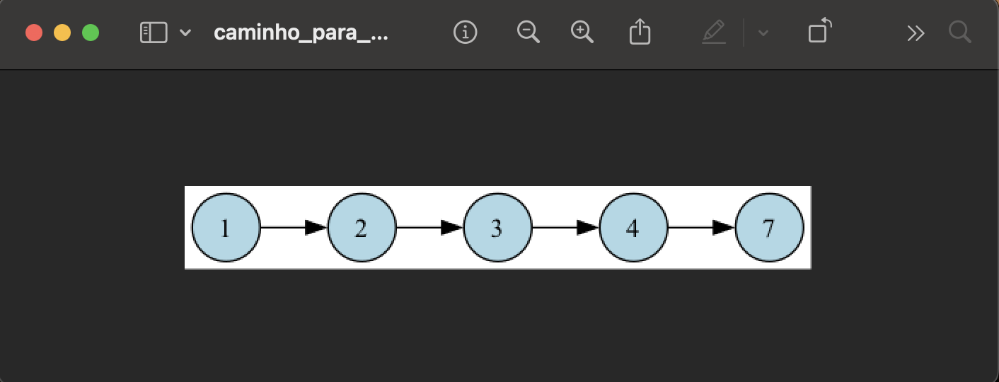

# Parking lot

**Número da Lista**: 1  
**Conteúdo da Disciplina**: FGA0124 - PROJETO DE ALGORITMOS - T01  


## Alunos


<div align = "center">
<table>
  <tr>
    <td align="center"><a href="https://github.com/BiancaPatrocinio7"><br /><sub><b>Bianca Patrocínio</b></sub></a><br /><a href="Link git" title="Rocketseat"></a></td>
    <td align="center"><a href="https://github.com/leticiatmartins"><br /><sub><b>Leticia Torres </b></sub></a><br />
  </tr>
</table>

| Matrícula   | Aluno                             |
| ----------- | ---------------------------------- |
| 22/1008801  | Bianca Patrocínio Castro           |
| 20/2016702  | Leticia Torres Soares Martins      |
</div>

## Sobre 
O sistema de estacionamento simula a alocação de vagas de estacionamento para clientes em um shopping, com 18 vagas e 6 lojas, utilizando algoritmos de grafos. O objetivo é encontrar a vaga mais próxima de uma loja específica usando a busca em largura (BFS).

## Screenshots
<p align="center">
  
</p>

<p align="center">
  
</p>

<p align="center">
  
</p>

<p align="center">
  
</p>

<p align="center">
  
</p>

<p align="center">
  
</p>

<p align="center">
  
</p>

<p align="center">
  
</p>

<p align="center">
  
</p>


## Instalação 
**Linguagem**: C++

## Pré-requisitos

Antes de rodar o projeto, você precisará ter os seguintes programas instalados:

- **g++** (compilador C++).
- **make** (ferramenta de automação de builds).
- **Graphviz (dot)** para gerar e visualizar os grafos do caminho.

### Instalar g++, make e dot

#### No macOS:
Se você usa macOS, pode instalar com o Homebrew:

```bash
brew install gcc make graphviz
```

#### No Linux (Ubuntu/Debian):
No Linux, instale com:

```bash
sudo apt update
sudo apt install build-essential graphviz
```

## Como compilar e executar o projeto
### Passo 1: Clonar o repositório
```bash
git clone https://github.com/seu-usuario/Grafos-1-Parking-lot.git
cd Grafos-1-Parking-lot
```

### Passo 2: Compilar o projeto
Para compilar o projeto, use o comando make. Isso irá compilar todos os arquivos fonte e gerar o executável:

```bash
make
```

### Passo 3: Rodar o projeto
Após a compilação, execute o programa gerado:

```bash
./Grafos-1-Parking-lot
```

## Uso 
Após rodar o programa, escolha uma loja. O sistema encontrará a vaga mais próxima disponível usando o algoritmo BFS, e um grafo será gerado mostrando o caminho até essa vaga.

O grafo será salvo como uma imagem `.png` no formato:

```
caminho_para_vaga_X.png
```

(onde `X` é o número da vaga).

## Apresentação 

<div align="center">
<a href="https://youtu.be/PoJ3FK-J3wM?si=VLjQ5nK-w6U8Dh7-"></a>
</div>

<font size="3"><p style="text-align: center">Autor: [Bianca Patrocínio](https://github.com/BiancaPatrocinio7) e [Letícia Torres](https://github.com/leticiatmartins).</p></font>


## Outros 
- O projeto usa a biblioteca Graphviz para gerar arquivos `.dot` e convertê-los em imagens PNG.
- Se tiver problemas para visualizar as imagens, verifique se o `dot` está instalado corretamente.
  


